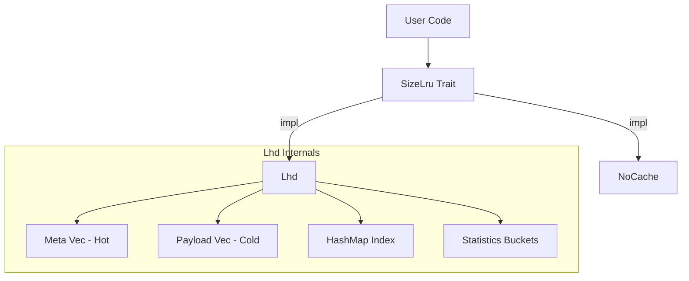
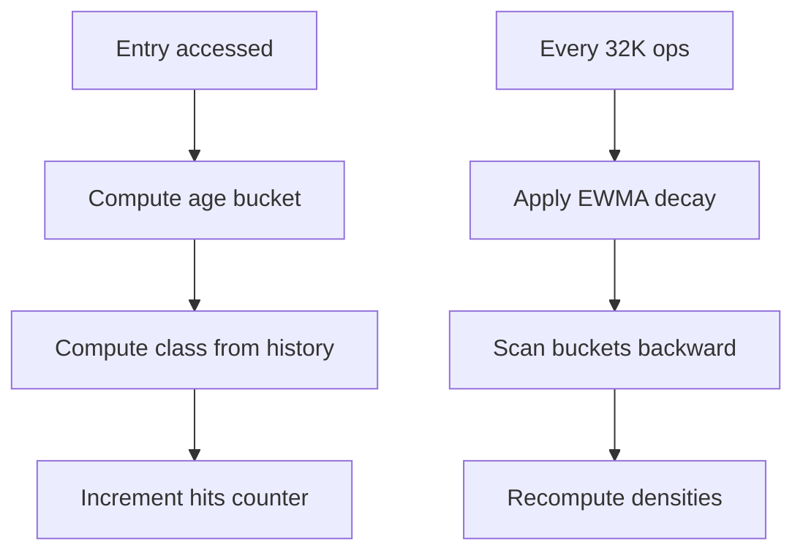

# size_lru: Fastest Size-Aware LRU Cache

[](https://crates.io/crates/size_lru)
[](https://docs.rs/size_lru)
[](https://opensource.org/licenses/MulanPSL-2.0)

The fastest size-aware LRU cache in Rust. Implements LHD (Least Hit Density) algorithm to achieve the highest hit rate while maintaining O(1) operations.

**Best for variable-sized keys and values** (strings, byte arrays, serialized objects). For fixed-size entries, standard LRU suffices.


## Table of Contents

- [Performance](#performance)
- [Algorithm](#algorithm)
- [Features](#features)
- [Installation](#installation)
- [Usage](#usage)
- [API Reference](#api-reference)
- [How to Build?](#how-to-build)
- [Design](#design)
- [Tech Stack](#tech-stack)
- [Directory Structure](#directory-structure)
- [Benchmarks](#benchmarks)
- [History](#history)

## Performance

size_lru is the fastest size-aware cache with the highest effective throughput among all tested libraries.

Key advantages:

- **74.94% hit rate** — 17+ percentage points higher than standard LRU (57.8%)
- **6.06M ops/s raw throughput** — fastest among all tested libraries
- **0.21M/s effective throughput** — 23% faster than moka, 65% faster than standard LRU
- **O(1) operations** — constant time regardless of cache size

## Algorithm

### LHD: Least Hit Density

Traditional LRU asks: "Which item was least recently used?"

LHD asks: "Which item has the lowest expected hits per unit of space?"

The core insight: not all cache entries are equal. A 1KB object accessed once per hour wastes more space than a 100B object accessed once per minute. LHD quantifies this by computing **hit density** = expected_hits / size.

### How It Works

1. **Age Classification**: Entries are grouped into 16 classes based on access patterns (last_age + prev_age). This captures temporal locality without storing full history.

2. **Statistical Tracking**: Each class maintains 4096 age buckets. On access, increment hits[class][age]. On eviction, increment evicts[class][age].

3. **Density Estimation**: Periodically recalculate density for each bucket using cumulative hit probability:
   ```
   density[age] = cumulative_hits / cumulative_lifetime
   ```

4. **Eviction**: Sample 256 random candidates, select the one with minimum density/size ratio.

### Why Random Sampling?

Full scan is O(n). Maintaining a priority queue adds overhead and contention. Random sampling achieves near-optimal eviction in O(1) time with high probability. The paper shows 256 samples capture 99%+ of optimal hit rate.

### Adaptive Coarsening

Access timestamps are coarsened by a dynamic shift factor. When cache grows, shift increases to keep age buckets meaningful. This prevents bucket overflow while preserving statistical accuracy.

## Features

- **Size Awareness**: Eviction considers actual byte size, not just entry count
- **Intelligent Eviction**: LHD maximizes hit rate per byte of memory
- **O(1) Operations**: Get, set, remove all run in constant time
- **Adaptive Tuning**: Internal parameters adjust to workload patterns
- **Zero Overhead Option**: `NoCache` implementation for baseline testing

## Installation

```toml
[dependencies]
size_lru = { version = "0.1", features = ["lhd"] }
```

## Usage

### Usage Guidelines

#### 1. Accurate size Parameter

The `size` parameter in `set` should reflect actual memory usage. An internal 96-byte overhead is added automatically.

```rust
use size_lru::Lhd;

let mut cache: Lhd<String, Vec<u8>> = Lhd::new(1024 * 1024);

// Correct: pass actual data size
let data = vec![0u8; 1000];
cache.set("key".into(), data, 1000);

// Wrong: mismatched size causes memory estimation errors
// cache.set("key".into(), large_data, 1);  // Don't do this
```

#### 2. OnRm Callback Notes

Callback fires before removal or eviction. Use `cache.get(key)` to access the value being evicted.

**Why callback only passes key, not value?**

- Many use cases only need key (logging, counting, notifying external systems)
- If value not needed, avoids one memory access overhead
- When value needed, call `cache.get(key)` to retrieve it

```rust
use size_lru::{Lhd, OnRm};

struct EvictLogger;

impl<V> OnRm<i32, Lhd<i32, V, Self>> for EvictLogger {
  fn call(&mut self, key: &i32, cache: &mut Lhd<i32, V, Self>) {
    // Safe: value accessible before removal
    if let Some(_val) = cache.get(key) {
      println!("Evicting key={key}");
    }
    // ⚠️ WARNING: NEVER call rm/set in callback - causes undefined behavior!
    // Reasons:
    // 1. Reentrancy: callback runs inside evict/rm while cache is in intermediate state
    //    - index may have removed key, but metas/payloads not yet cleaned up
    //    - calling set may trigger new eviction, causing recursive eviction
    // 2. Iterator invalidation: rm_idx uses swap_remove, moving last element to deleted position
    //    - removing other entries in callback may corrupt ongoing swap operation
    //    - leads to index pointing to wrong position or dangling references
    // 3. Borrow conflict: callback holds &mut cache, internal ops also need &mut self
    //    - Rust borrow checker bypassed via unsafe, but data race actually exists
  }
}

let mut cache: Lhd<i32, String, EvictLogger> = Lhd::with_on_rm(1024, EvictLogger);
cache.set(1, "value".into(), 5);
```

#### 3. Capacity Planning

`max` is the byte limit. Each entry has 96-byte fixed overhead:

```rust
use size_lru::Lhd;

// Store 1000 entries averaging 100 bytes
// Actual need: 1000 * (100 + 96) ≈ 196KB
let mut cache: Lhd<i32, Vec<u8>> = Lhd::new(200 * 1024);
```

#### 4. Key Type Requirements

Keys must implement `Hash + Eq`, and `Clone` for insertion:

```rust
use size_lru::Lhd;

// Recommended: lightweight keys
let mut cache: Lhd<u64, String> = Lhd::new(1024);

// Avoid: large keys increase clone overhead
// let mut cache: Lhd<String, String> = Lhd::new(1024);
```

#### 5. Not Thread-Safe

`Lhd` is not thread-safe. Use external synchronization for concurrent access:

```rust
use std::sync::Mutex;
use size_lru::Lhd;

let cache = Mutex::new(Lhd::<i32, String>::new(1024));

// Thread-safe access
{
  let mut guard = cache.lock().unwrap();
  guard.set(1, "value".into(), 5);
}
```

## API Reference

### `trait OnRm<K, C>`

Removal callback interface. Called before actual removal or eviction, so `cache.get(key)` still works.

- `call(&mut self, key: &K, cache: &mut C)` — Called on entry removal/eviction

### `struct NoOnRm`

No-op callback with zero overhead. Default when using `new()`.

### `trait SizeLru<K, V>`

Core cache interface.

- `with_on_rm(max: usize, on_rm: Rm) -> Self::WithRm<Rm>` — Create with max byte capacity and optional callback. The callback fires when entries are removed or evicted.
- `get<Q>(&mut self, key: &Q) -> Option<&V>` — Retrieve value, update hit statistics
- `peek<Q>(&self, key: &Q) -> Option<&V>` — Peek value without updating hit statistics. Use for cache checks to avoid affecting hit rate calculations
- `set(&mut self, key: K, val: V, size: u32)` — Insert/update, trigger eviction if needed
- `rm<Q>(&mut self, key: &Q)` — Remove entry
- `is_empty(&self) -> bool` — Check if cache is empty
- `len(&self) -> usize` — Get entry count

### `struct Lhd<K, V, F = NoOnRm>`

LHD implementation with configurable removal callback. Implements `SizeLru` trait. Additional methods:

- `size(&self) -> usize` — Total bytes stored
- `len(&self) -> usize` — Entry count
- `is_empty(&self) -> bool` — Check if empty

### `struct NoCache`

Zero-overhead no-op cache implementation. Implements `SizeLru` trait with all methods as no-ops. Use this when you don't need LRU but want to reuse code that expects a `SizeLru` implementation (e.g., for database wlog GC).

## How to Build?

This library depends on the hardware-accelerated hash library `gxhash`.

`gxhash` uses different acceleration instructions on different hardware.

- Compiles directly on macOS and other `arm` chips
- On `x86_64`, compilation requires enabling modern CPU features `aes` and `sse2`, which are generally supported

You can configure this in your build script as follows:

```bash
if [[ "$(uname -m)" == "x86_64" ]]; then
  export RUSTFLAGS="$RUSTFLAGS -C target-feature=+aes,+sse2"
fi
```

If you are deploying to your own machines (not distributing to third parties), you can be more aggressive:

```bash
export RUSTFLAGS="-C target-cpu=native"
```

## Design

### Architecture



### Data Layout

SoA (Structure of Arrays) layout separates hot metadata from cold payload:

```
Meta (16 bytes, 4 per cache line):
  ts: u64        - Last access timestamp
  size: u32      - Entry size (includes 96-byte overhead)
  last_age: u16  - Previous access age
  prev_age: u16  - Age before previous

Payload (cold):
  key: K
  val: V
```

This improves cache locality during eviction sampling.

### Eviction Flow


### Statistics Update



## Tech Stack

| Component | Purpose |
|-----------|---------|
| [gxhash](https://crates.io/crates/gxhash) | Fast non-cryptographic hashing |
| [fastrand](https://crates.io/crates/fastrand) | Efficient PRNG for sampling |

## Directory Structure

```
src/
  lib.rs    # Trait definition, module exports
  lhd.rs    # LHD implementation
  no.rs     # NoCache implementation
tests/
  main.rs   # Integration tests
benches/
  comparison.rs  # Performance benchmarks
```

## Benchmarks

Run benchmarks:

```bash
cargo bench --features all
```

The benchmarks compare size_lru against:
- [lru](https://crates.io/crates/lru) - Standard LRU cache
- [moka](https://crates.io/crates/moka) - Concurrent cache library
- [mini-moka](https://crates.io/crates/mini-moka) - Lightweight moka
- [clru](https://crates.io/crates/clru) - Concurrent LRU
- [hashlink](https://crates.io/crates/hashlink) - LRU with hash
- [schnellru](https://crates.io/crates/schnellru) - Fast LRU

## History

### The Quest for Optimal Caching

In 1966, László Bélády proved that the optimal cache eviction strategy is to remove the item that will be needed furthest in the future. This "clairvoyant" algorithm (MIN/OPT) is theoretically perfect but practically impossible—we cannot predict the future.

LRU emerged as a practical approximation: assume recent access predicts future access. For decades, LRU and its variants (LRU-K, ARC, LIRS) dominated cache design.

### The Size Problem

Traditional algorithms treat all entries equally. But in real workloads, object sizes vary by orders of magnitude. A 1MB image and a 100B metadata record compete for the same cache slot under LRU, despite vastly different costs.

### LHD: A Probabilistic Approach

In 2018, Nathan Beckmann and colleagues at CMU published "LHD: Improving Cache Hit Rate by Maximizing Hit Density" at NSDI. Instead of heuristics, they modeled caching as an optimization problem: maximize total hits given fixed memory.

The key insight: track hit probability conditioned on object age and access history. By estimating expected future hits and dividing by size, LHD identifies which bytes contribute least to hit rate.

Their evaluation showed LHD requires 8x less space than LRU to achieve the same hit rate, and 2-3x less than contemporary algorithms like ARC.

### This Implementation

size_lru brings LHD to Rust with practical optimizations:

- SoA layout for cache-friendly eviction sampling
- Flattened statistics array for vectorization
- Adaptive age coarsening for varying workloads
- Zero-allocation steady state

The result: academic algorithm, production performance.

### References

- [LHD Paper (NSDI '18)](https://www.usenix.org/conference/nsdi18/presentation/beckmann)
- [Bélády's Algorithm (1966)](https://en.wikipedia.org/wiki/B%C3%A9l%C3%A1dy%27s_algorithm)
- [CMU Parallel Data Lab](https://www.pdl.cmu.edu/CILES/)
