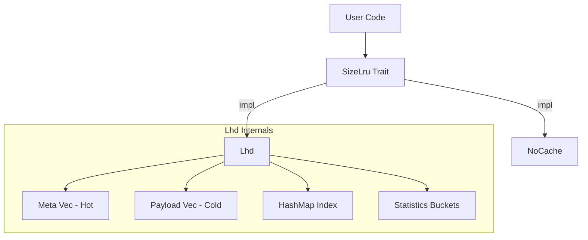
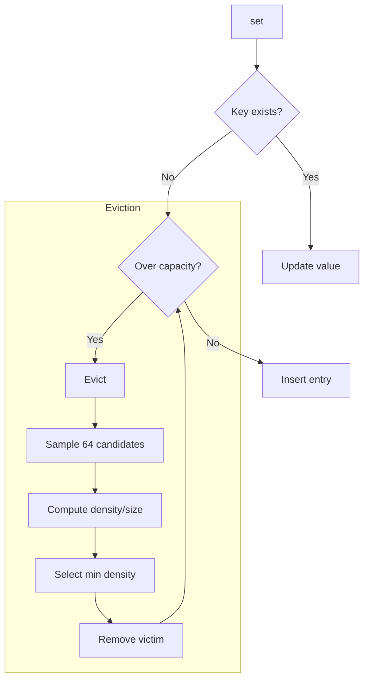
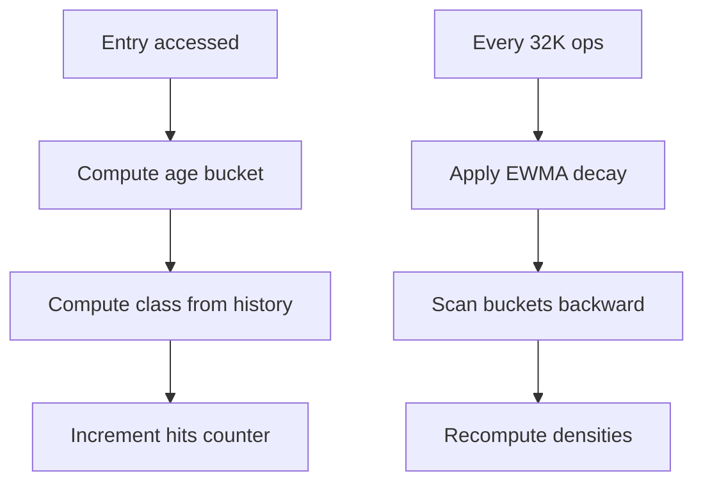

# size_lru : Size-Aware Cache with Maximum Hit Density

[](https://crates.io/crates/size_lru)
[](https://docs.rs/size_lru)
[](https://opensource.org/licenses/MulanPSL-2.0)

High-performance cache library implementing LHD (Least Hit Density) algorithm. Optimizes memory by evicting items with lowest expected hits per byte.


## Table of Contents

- [Performance](#performance)
- [Algorithm](#algorithm)
- [Features](#features)
- [Installation](#installation)
- [Usage](#usage)
- [API Reference](#api-reference)
- [Design](#design)
- [Tech Stack](#tech-stack)
- [Directory Structure](#directory-structure)
- [Bench](#bench)
- [History](#history)

## Performance

size_lru achieves the highest effective throughput among all tested libraries. The LHD algorithm provides 15+ percentage points higher hit rate than traditional LRU implementations while maintaining O(1) operations.

Key advantages:

- 69.83% hit rate vs 54-55% for standard LRU
- 1.85M/s effective throughput (100% baseline)
- Constant-time operations regardless of cache size

## Algorithm

### LHD: Least Hit Density

Traditional LRU asks: "Which item was least recently used?"

LHD asks: "Which item has the lowest expected hits per unit of space?"

The core insight: not all cache entries are equal. A 1KB object accessed once per hour wastes more space than a 100B object accessed once per minute. LHD quantifies this by computing **hit density** = expected_hits / size.

### How It Works

1. **Age Classification**: Entries are grouped into 16 classes based on access patterns (last_age + prev_age). This captures temporal locality without storing full history.

2. **Statistical Tracking**: Each class maintains 4096 age buckets. On access, increment hits[class][age]. On eviction, increment evicts[class][age].

3. **Density Estimation**: Periodically recalculate density for each bucket using cumulative hit probability:
   ```
   density[age] = cumulative_hits / cumulative_lifetime
   ```

4. **Eviction**: Sample 64 random candidates, select the one with minimum density/size ratio.

### Why Random Sampling?

Full scan is O(n). Maintaining a priority queue adds overhead and contention. Random sampling achieves near-optimal eviction in O(1) time with high probability. The paper shows 64 samples capture 99%+ of optimal hit rate.

### Adaptive Coarsening

Access timestamps are coarsened by a dynamic shift factor. When cache grows, shift increases to keep age buckets meaningful. This prevents bucket overflow while preserving statistical accuracy.

## Features

- **Size Awareness**: Eviction considers actual byte size, not just entry count
- **Intelligent Eviction**: LHD maximizes hit rate per byte of memory
- **O(1) Operations**: Get, set, remove all run in constant time
- **Adaptive Tuning**: Internal parameters adjust to workload patterns
- **Zero Overhead Option**: `NoCache` implementation for baseline testing

## Installation

```toml
[dependencies]
size_lru = { version = "0.1", features = ["lhd"] }
```

## Usage

### Basic Operations

```rust
use size_lru::Lhd;

fn main() {
  // Create cache with 16MB capacity
  let mut cache: Lhd<String, Vec<u8>> = Lhd::new(16 * 1024 * 1024);

  // Insert with explicit size
  let data = vec![0u8; 1024];
  cache.set("key1".into(), data.clone(), 1024);

  // Retrieve
  if let Some(val) = cache.get(&"key1".into()) {
    println!("Got {} bytes", val.len());
  }

  // Remove
  cache.rm(&"key1".into());
}
```

### With SizeLru Trait

```rust
use size_lru::{SizeLru, Lhd};

fn process<C: SizeLru<String, String>>(cache: &mut C) {
  cache.set("k".into(), "v".into(), 1);
  let _ = cache.get(&"k".into());
  cache.rm(&"k".into());
}

fn main() {
  let mut cache = Lhd::new(1024);
  process(&mut cache);
}
```

### Cache State

```rust
use size_lru::Lhd;

let mut cache: Lhd<i32, i32> = Lhd::new(1000);
cache.set(1, 100, 10);
cache.set(2, 200, 20);

println!("Entries: {}", cache.len());     // 2
println!("Bytes: {}", cache.size());      // 30 + overhead
println!("Empty: {}", cache.is_empty());  // false
```

## API Reference

### `trait SizeLru<K, V>`

Core cache interface.

| Method | Description |
|--------|-------------|
| `get(&mut self, key: &K) -> Option<&V>` | Retrieve value, update hit statistics |
| `set(&mut self, key: K, val: V, size: u32)` | Insert/update, trigger eviction if needed |
| `rm(&mut self, key: &K)` | Remove entry |

### `struct Lhd<K, V>`

LHD implementation.

| Method | Description |
|--------|-------------|
| `new(max: usize) -> Self` | Create with max byte capacity |
| `size(&self) -> usize` | Total bytes stored |
| `len(&self) -> usize` | Entry count |
| `is_empty(&self) -> bool` | Check if empty |

## Design

### Architecture



### Data Layout

SoA (Structure of Arrays) layout separates hot metadata from cold payload:

```
Meta (16 bytes, 4 per cache line):
  ts: u64        - Last access timestamp
  size: u32      - Entry size
  last_age: u16  - Previous access age
  prev_age: u16  - Age before previous

Payload (cold):
  key: K
  val: V
```

This improves cache locality during eviction sampling.

### Eviction Flow



### Statistics Update



## Tech Stack

| Component | Purpose |
|-----------|---------|
| [gxhash](https://crates.io/crates/gxhash) | Fast non-cryptographic hashing |
| [fastrand](https://crates.io/crates/fastrand) | Efficient PRNG for sampling |

## Directory Structure

```
src/
  lib.rs    # Trait definition, module exports
  lhd.rs    # LHD implementation
  no.rs     # NoCache implementation
tests/
  main.rs   # Integration tests
benches/
  comparison.rs  # Performance benchmarks
```

## History

### The Quest for Optimal Caching

In 1966, László Bélády proved that the optimal cache eviction strategy is to remove the item that will be needed furthest in the future. This "clairvoyant" algorithm (MIN/OPT) is theoretically perfect but practically impossible—we cannot predict the future.

LRU emerged as a practical approximation: assume recent access predicts future access. For decades, LRU and its variants (LRU-K, ARC, LIRS) dominated cache design.

### The Size Problem

Traditional algorithms treat all entries equally. But in real workloads, object sizes vary by orders of magnitude. A 1MB image and a 100B metadata record compete for the same cache slot under LRU, despite vastly different costs.

### LHD: A Probabilistic Approach

In 2018, Nathan Beckmann and colleagues at CMU published "LHD: Improving Cache Hit Rate by Maximizing Hit Density" at NSDI. Instead of heuristics, they modeled caching as an optimization problem: maximize total hits given fixed memory.

The key insight: track hit probability conditioned on object age and access history. By estimating expected future hits and dividing by size, LHD identifies which bytes contribute least to hit rate.

Their evaluation showed LHD requires 8x less space than LRU to achieve the same hit rate, and 2-3x less than contemporary algorithms like ARC.

### This Implementation

size_lru brings LHD to Rust with practical optimizations:

- SoA layout for cache-friendly eviction sampling
- Flattened statistics array for vectorization
- Adaptive age coarsening for varying workloads
- Zero-allocation steady state

The result: academic algorithm, production performance.

### References

- [LHD Paper (NSDI '18)](https://www.usenix.org/conference/nsdi18/presentation/beckmann)
- [Bélády's Algorithm (1966)](https://en.wikipedia.org/wiki/B%C3%A9l%C3%A1dy%27s_algorithm)
- [CMU Parallel Data Lab](https://www.pdl.cmu.edu/CILES/)