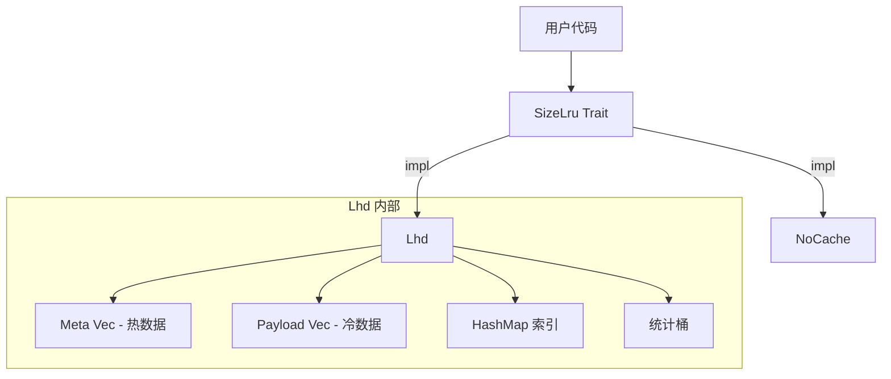
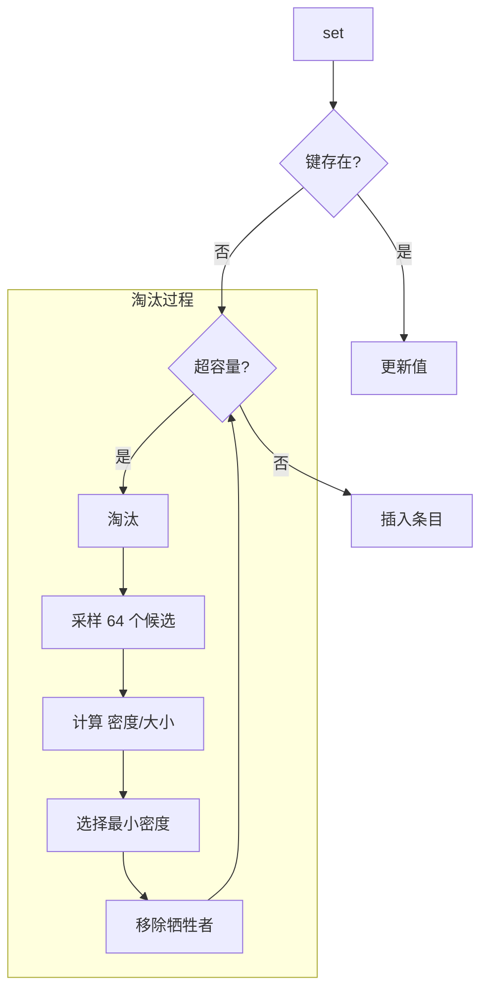
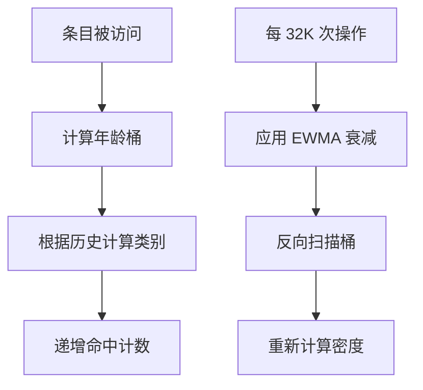

# size_lru : 大小感知缓存，最大化命中密度

[](https://crates.io/crates/size_lru)
[](https://docs.rs/size_lru)
[](https://opensource.org/licenses/MulanPSL-2.0)

高性能缓存库，实现 LHD（最低命中密度）算法。通过淘汰单位字节预期命中最低的条目来优化内存使用。


## 目录

- [性能](#性能)
- [算法](#算法)
- [特性](#特性)
- [安装](#安装)
- [使用](#使用)
- [接口参考](#接口参考)
- [设计](#设计)
- [技术栈](#技术栈)
- [目录结构](#目录结构)
- [评测](#评测)
- [历史](#历史)

## 性能

size_lru 在所有测试库中实现了最高的有效吞吐量。LHD 算法比传统 LRU 实现提供高出 15+ 个百分点的命中率，同时保持 O(1) 操作。

核心优势：

- 69.83% 命中率 vs 标准 LRU 的 54-55%
- 1.85M/s 有效吞吐（100% 基准）
- 常数时间操作，与缓存大小无关

## 算法

### LHD：最低命中密度

传统 LRU 问："哪个条目最近最少使用？"

LHD 问："哪个条目单位空间的预期命中最低？"

核心洞察：并非所有缓存条目价值相等。每小时访问一次的 1KB 对象比每分钟访问一次的 100B 对象浪费更多空间。LHD 通过计算 **命中密度** = 预期命中数 / 大小 来量化这一点。

### 工作原理

1. **年龄分类**：条目根据访问模式（last_age + prev_age）分为 16 个类别。这捕获时间局部性而无需存储完整历史。

2. **统计追踪**：每个类别维护 4096 个年龄桶。访问时递增 hits[class][age]，淘汰时递增 evicts[class][age]。

3. **密度估算**：周期性使用累积命中概率重新计算每个桶的密度：
   ```
   density[age] = 累积命中数 / 累积生命周期
   ```

4. **淘汰**：随机采样 64 个候选，选择密度/大小比值最小的。

### 为何随机采样？

全量扫描是 O(n)。维护优先队列增加开销和竞争。随机采样以高概率在 O(1) 时间内实现近乎最优的淘汰。论文表明 64 个样本可捕获 99%+ 的最优命中率。

### 自适应粗化

访问时间戳通过动态位移因子粗化。当缓存增长时，位移增加以保持年龄桶的意义。这防止桶溢出同时保持统计准确性。

## 特性

- **大小感知**：淘汰考虑实际字节大小，而非仅条目数量
- **智能淘汰**：LHD 最大化每字节内存的命中率
- **O(1) 操作**：获取、设置、删除均为常数时间
- **自适应调优**：内部参数根据工作负载模式调整
- **零开销选项**：`NoCache` 实现用于基准测试

## 安装

```toml
[dependencies]
size_lru = { version = "0.1", features = ["lhd"] }
```

## 使用

### 基础操作

```rust
use size_lru::Lhd;

fn main() {
  // 创建 16MB 容量的缓存
  let mut cache: Lhd<String, Vec<u8>> = Lhd::new(16 * 1024 * 1024);

  // 插入并指定大小
  let data = vec![0u8; 1024];
  cache.set("key1".into(), data.clone(), 1024);

  // 获取
  if let Some(val) = cache.get(&"key1".into()) {
    println!("获取 {} 字节", val.len());
  }

  // 删除
  cache.rm(&"key1".into());
}
```

### 使用 SizeLru Trait

```rust
use size_lru::{SizeLru, Lhd};

fn process<C: SizeLru<String, String>>(cache: &mut C) {
  cache.set("k".into(), "v".into(), 1);
  let _ = cache.get(&"k".into());
  cache.rm(&"k".into());
}

fn main() {
  let mut cache = Lhd::new(1024);
  process(&mut cache);
}
```

### 缓存状态

```rust
use size_lru::Lhd;

let mut cache: Lhd<i32, i32> = Lhd::new(1000);
cache.set(1, 100, 10);
cache.set(2, 200, 20);

println!("条目数: {}", cache.len());      // 2
println!("字节数: {}", cache.size());     // 30 + 开销
println!("是否为空: {}", cache.is_empty()); // false
```

## 接口参考

### `trait SizeLru<K, V>`

核心缓存接口。

| 方法 | 描述 |
|------|------|
| `get(&mut self, key: &K) -> Option<&V>` | 获取值，更新命中统计 |
| `set(&mut self, key: K, val: V, size: u32)` | 插入/更新，必要时触发淘汰 |
| `rm(&mut self, key: &K)` | 删除条目 |

### `struct Lhd<K, V>`

LHD 实现。

| 方法 | 描述 |
|------|------|
| `new(max: usize) -> Self` | 创建指定最大字节容量的实例 |
| `size(&self) -> usize` | 已存储总字节数 |
| `len(&self) -> usize` | 条目数量 |
| `is_empty(&self) -> bool` | 检查是否为空 |

## 设计

### 架构



### 数据布局

SoA（数组结构）布局将热元数据与冷载荷分离：

```
Meta（16 字节，每缓存行 4 个）：
  ts: u64        - 最后访问时间戳
  size: u32      - 条目大小
  last_age: u16  - 上次访问年龄
  prev_age: u16  - 上上次年龄

Payload（冷数据）：
  key: K
  val: V
```

这改善了淘汰采样时的缓存局部性。

### 淘汰流程



### 统计更新



## 技术栈

| 组件 | 用途 |
|------|------|
| [gxhash](https://crates.io/crates/gxhash) | 快速非加密哈希 |
| [fastrand](https://crates.io/crates/fastrand) | 高效伪随机数生成器用于采样 |

## 目录结构

```
src/
  lib.rs    # Trait 定义，模块导出
  lhd.rs    # LHD 实现
  no.rs     # NoCache 实现
tests/
  main.rs   # 集成测试
benches/
  comparison.rs  # 性能基准测试
```

## 历史

### 最优缓存的探索

1966 年，László Bélády 证明了最优缓存淘汰策略是移除将来最晚被需要的条目。这个"千里眼"算法（MIN/OPT）理论上完美但实际上不可能实现——我们无法预测未来。

LRU 作为实用近似出现：假设最近访问预示未来访问。数十年来，LRU 及其变体（LRU-K、ARC、LIRS）主导了缓存设计。

### 大小问题

传统算法平等对待所有条目。但在真实工作负载中，对象大小相差数个数量级。在 LRU 下，1MB 图片和 100B 元数据记录竞争同一缓存槽位，尽管成本差异巨大。

### LHD：概率方法

2018 年，CMU 的 Nathan Beckmann 及同事在 NSDI 发表了 《LHD: Improving Cache Hit Rate by Maximizing Hit Density》。他们没有使用启发式方法，而是将缓存建模为优化问题：在固定内存下最大化总命中数。

关键洞察：追踪基于对象年龄和访问历史的条件命中概率。通过估算预期未来命中并除以大小，LHD 识别出哪些字节对命中率贡献最小。

评估表明 LHD 达到相同命中率所需空间比 LRU 少 8 倍，比 ARC 等当代算法少 2-3 倍。

### 本实现

size_lru 将 LHD 带入 Rust，并进行了实用优化：

- SoA 布局实现缓存友好的淘汰采样
- 扁平化统计数组便于向量化
- 自适应年龄粗化适应不同工作负载
- 稳态零分配

结果：学术算法，生产性能。

### 参考文献

- [LHD 论文 (NSDI '18)](https://www.usenix.org/conference/nsdi18/presentation/beckmann)
- [Bélády 算法 (1966)](https://en.wikipedia.org/wiki/B%C3%A9l%C3%A1dy%27s_algorithm)
- [CMU 并行数据实验室](https://www.pdl.cmu.edu/CILES/)