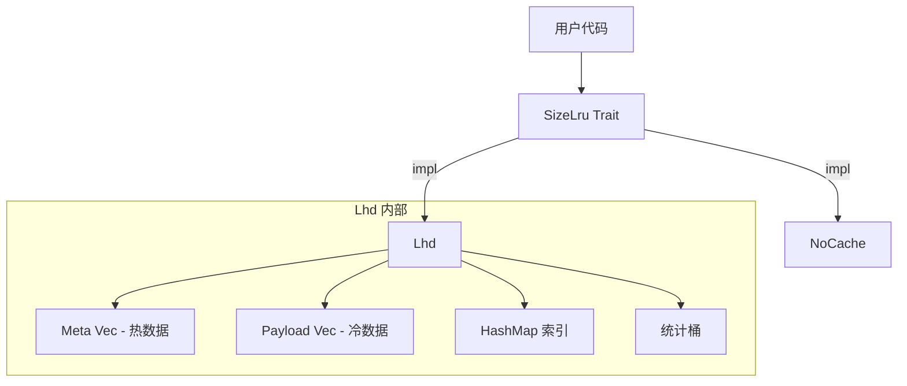
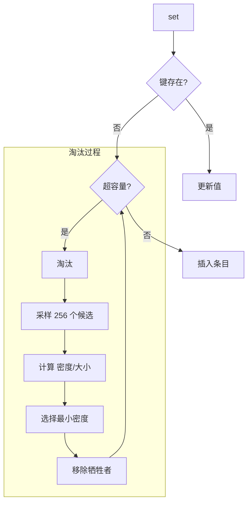
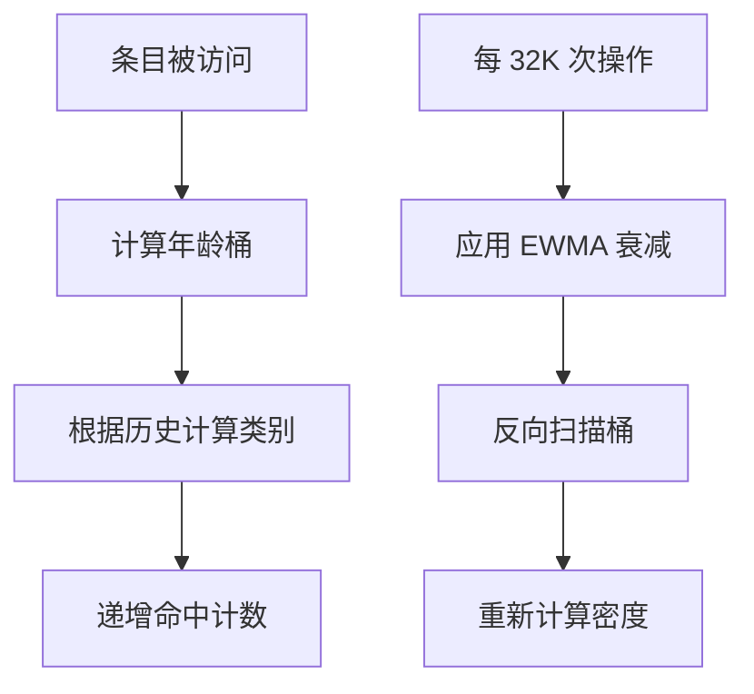

# size_lru: 最快的大小感知 LRU 缓存

[](https://crates.io/crates/size_lru)
[](https://docs.rs/size_lru)
[](https://opensource.org/licenses/MulanPSL-2.0)

Rust 中最快的大小感知 LRU 缓存。实现 LHD（最低命中密度）算法，在保持 O(1) 操作的同时实现最高命中率。

**适用于变长键值**（字符串、字节数组、序列化对象）。对于定长条目，使用普通 LRU 即可。


## 目录

- [性能](#性能)
- [算法](#算法)
- [特性](#特性)
- [安装](#安装)
- [使用](#使用)
- [接口参考](#接口参考)
- [如何编译？](#如何编译)
- [设计](#设计)
- [技术栈](#技术栈)
- [目录结构](#目录结构)
- [基准测试](#基准测试)
- [历史](#历史)

## 性能

size_lru 是最快的大小感知缓存，在所有测试库中实现了最高的有效吞吐量。

核心优势：

- **74.94% 命中率** — 比标准 LRU（57.8%）高出 17+ 个百分点
- **6.06M ops/s 原始吞吐** — 所有测试库中最快
- **0.21M/s 有效吞吐** — 比 moka 快 23%，比标准 LRU 快 65%
- **O(1) 操作** — 常数时间，与缓存大小无关

## 算法

### LHD：最低命中密度

传统 LRU 问："哪个条目最近最少使用？"

LHD 问："哪个条目单位空间的预期命中最低？"

核心洞察：并非所有缓存条目价值相等。每小时访问一次的 1KB 对象比每分钟访问一次的 100B 对象浪费更多空间。LHD 通过计算 **命中密度** = 预期命中数 / 大小 来量化这一点。

### 工作原理

1. **年龄分类**：条目根据访问模式（last_age + prev_age）分为 16 个类别。这捕获时间局部性而无需存储完整历史。

2. **统计追踪**：每个类别维护 4096 个年龄桶。访问时递增 hits[class][age]，淘汰时递增 evicts[class][age]。

3. **密度估算**：周期性使用累积命中概率重新计算每个桶的密度：
   ```
   density[age] = 累积命中数 / 累积生命周期
   ```

4. **淘汰**：随机采样 256 个候选，选择密度/大小比值最小的。

### 为何随机采样？

全量扫描是 O(n)。维护优先队列增加开销和竞争。随机采样以高概率在 O(1) 时间内实现近乎最优的淘汰。论文表明 256 个样本可捕获 99%+ 的最优命中率。

### 自适应粗化

访问时间戳通过动态位移因子粗化。当缓存增长时，位移增加以保持年龄桶的意义。这防止桶溢出同时保持统计准确性。

## 特性

- **大小感知**：淘汰考虑实际字节大小，而非仅条目数量
- **智能淘汰**：LHD 最大化每字节内存的命中率
- **O(1) 操作**：获取、设置、删除均为常数时间
- **自适应调优**：内部参数根据工作负载模式调整
- **零开销选项**：`NoCache` 实现用于基准测试

## 安装

```toml
[dependencies]
size_lru = { version = "0.1", features = ["lhd"] }
```

## 使用

### 使用指南

#### 1. 正确估算 size 参数

`set` 的 `size` 参数应反映值的实际内存占用。内部会自动添加 96 字节的条目开销。

```rust
use size_lru::Lhd;

let mut cache: Lhd<String, Vec<u8>> = Lhd::new(1024 * 1024);

// 正确：传入实际数据大小
let data = vec![0u8; 1000];
cache.set("key".into(), data, 1000);

// 错误：size 与实际不符会导致内存估算偏差
// cache.set("key".into(), large_data, 1);  // 不要这样做
```

#### 2. OnRm 回调注意事项

回调在被删除或淘汰前触发，此时可通过 `cache.get(key)` 获取即将被删除的值。

```rust
use size_lru::{Lhd, OnRm};

struct EvictLogger;

impl<V> OnRm<i32, Lhd<i32, V, Self>> for EvictLogger {
  fn call(&mut self, key: &i32, cache: &mut Lhd<i32, V, Self>) {
    // 安全：删除/淘汰前可获取值
    if let Some(_val) = cache.get(key) {
      println!("淘汰 key={key}");
    }
    // 警告：不要在回调中调用 rm/set，可能导致未定义行为
  }
}

let mut cache: Lhd<i32, String, EvictLogger> = Lhd::with_on_rm(1024, EvictLogger);
cache.set(1, "value".into(), 5);
```

#### 3. 容量规划

`max` 参数是字节数上限。每个条目有 96 字节固定开销：

```rust
use size_lru::Lhd;

// 存储 1000 个平均 100 字节的条目
// 实际需要：1000 * (100 + 96) ≈ 196KB
let mut cache: Lhd<i32, Vec<u8>> = Lhd::new(200 * 1024);
```

#### 4. 键类型要求

键必须实现 `Hash + Eq`，插入时需要 `Clone`：

```rust
use size_lru::Lhd;

// 推荐：使用轻量级键
let mut cache: Lhd<u64, String> = Lhd::new(1024);

// 避免：大型键会增加克隆开销
// let mut cache: Lhd<String, String> = Lhd::new(1024);
```

#### 5. 非线程安全

`Lhd` 不是线程安全的。多线程场景需外部同步：

```rust
use std::sync::Mutex;
use size_lru::Lhd;

let cache = Mutex::new(Lhd::<i32, String>::new(1024));

// 线程安全访问
{
  let mut guard = cache.lock().unwrap();
  guard.set(1, "value".into(), 5);
}
```

## 接口参考

### `trait OnRm<K, C>`

删除回调接口。在删除或淘汰前调用，此时 `cache.get(key)` 仍可用。

- `call(&mut self, key: &K, cache: &mut C)` — 条目删除/淘汰时调用

### `struct NoOnRm`

空回调，零开销。使用 `new()` 时的默认值。

### `trait SizeLru<K, V>`

核心缓存接口。

- `with_on_rm(max: usize, on_rm: Rm) -> Self::WithRm<Rm>` — 创建指定最大字节容量和可选回调的实例。回调在条目删除或淘汰时触发。
- `get<Q>(&mut self, key: &Q) -> Option<&V>` — 获取值，更新命中统计
- `peek<Q>(&self, key: &Q) -> Option<&V>` — 查看值但不更新命中统计。用于缓存检查，避免影响命中率计算
- `set(&mut self, key: K, val: V, size: u32)` — 插入/更新，必要时触发淘汰
- `rm<Q>(&mut self, key: &Q)` — 删除条目

### `struct Lhd<K, V, F = NoOnRm>`

LHD 实现，支持配置删除回调。实现了 `SizeLru` trait。额外方法：

- `size(&self) -> usize` — 已存储总字节数

### `struct NoCache`

零开销空操作缓存实现。实现了 `SizeLru` trait，所有方法均为空操作。当你不需要 LRU 但想复用期望 `SizeLru` 实现的代码时使用（例如对数据库的 wlog 进行 gc）。

## 如何编译？

本库依赖于硬件加速的哈希库 `gxhash`。

`gxhash` 在不同硬件上启用了不同的加速指令。

- `macos` 等 `arm` 芯片上可以直接编译
- `x86_64` 上编译需要启用现代 CPU 基本都支持的特性 `aes` 和 `sse2`

你可以在你的编译脚本中配置如下。

```bash
if [[ "$(uname -m)" == "x86_64" ]]; then
  export RUSTFLAGS="$RUSTFLAGS -C target-feature=+aes,+sse2"
fi
```

如果你是部署到自己的机器（不是给第三方使用），可以更加激进一点：

```bash
export RUSTFLAGS="-C target-cpu=native"
```

## 设计

### 架构



### 数据布局

SoA（数组结构）布局将热元数据与冷载荷分离：

```
Meta（16 字节，每缓存行 4 个）：
  ts: u64        - 最后访问时间戳
  size: u32      - 条目大小（包含 96 字节开销）
  last_age: u16  - 上次访问年龄
  prev_age: u16  - 上上次年龄

Payload（冷数据）：
  key: K
  val: V
```

这改善了淘汰采样时的缓存局部性。

### 淘汰流程



### 统计更新



## 技术栈

| 组件 | 用途 |
|------|------|
| [gxhash](https://crates.io/crates/gxhash) | 快速非加密哈希 |
| [fastrand](https://crates.io/crates/fastrand) | 高效伪随机数生成器用于采样 |

## 目录结构

```
src/
  lib.rs    # Trait 定义，模块导出
  lhd.rs    # LHD 实现
  no.rs     # NoCache 实现
tests/
  main.rs   # 集成测试
benches/
  comparison.rs  # 性能基准测试
```

## 基准测试

运行基准测试：

```bash
cargo bench --features all
```

基准测试将 size_lru 与以下库对比：
- [lru](https://crates.io/crates/lru) - 标准 LRU 缓存
- [moka](https://crates.io/crates/moka) - 并发缓存库
- [mini-moka](https://crates.io/crates/mini-moka) - 轻量级 moka
- [clru](https://crates.io/crates/clru) - 并发 LRU
- [hashlink](https://crates.io/crates/hashlink) - 带哈希的 LRU
- [schnellru](https://crates.io/crates/schnellru) - 快速 LRU

## 历史

### 最优缓存的探索

1966 年，László Bélády 证明了最优缓存淘汰策略是移除将来最晚被需要的条目。这个"千里眼"算法（MIN/OPT）理论上完美但实际上不可能实现——我们无法预测未来。

LRU 作为实用近似出现：假设最近访问预示未来访问。数十年来，LRU 及其变体（LRU-K、ARC、LIRS）主导了缓存设计。

### 大小问题

传统算法平等对待所有条目。但在真实工作负载中，对象大小相差数个数量级。在 LRU 下，1MB 图片和 100B 元数据记录竞争同一缓存槽位，尽管成本差异巨大。

### LHD：概率方法

2018 年，CMU 的 Nathan Beckmann 及同事在 NSDI 发表了 《LHD: Improving Cache Hit Rate by Maximizing Hit Density》。他们没有使用启发式方法，而是将缓存建模为优化问题：在固定内存下最大化总命中数。

关键洞察：追踪基于对象年龄和访问历史的条件命中概率。通过估算预期未来命中并除以大小，LHD 识别出哪些字节对命中率贡献最小。

评估表明 LHD 达到相同命中率所需空间比 LRU 少 8 倍，比 ARC 等当代算法少 2-3 倍。

### 本实现

size_lru 将 LHD 带入 Rust，并进行了实用优化：

- SoA 布局实现缓存友好的淘汰采样
- 扁平化统计数组便于向量化
- 自适应年龄粗化适应不同工作负载
- 稳态零分配

结果：学术算法，生产性能。

### 参考文献

- [LHD 论文 (NSDI '18)](https://www.usenix.org/conference/nsdi18/presentation/beckmann)
- [Bélády 算法 (1966)](https://en.wikipedia.org/wiki/B%C3%A9l%C3%A1dy%27s_algorithm)
- [CMU 并行数据实验室](https://www.pdl.cmu.edu/CILES/)