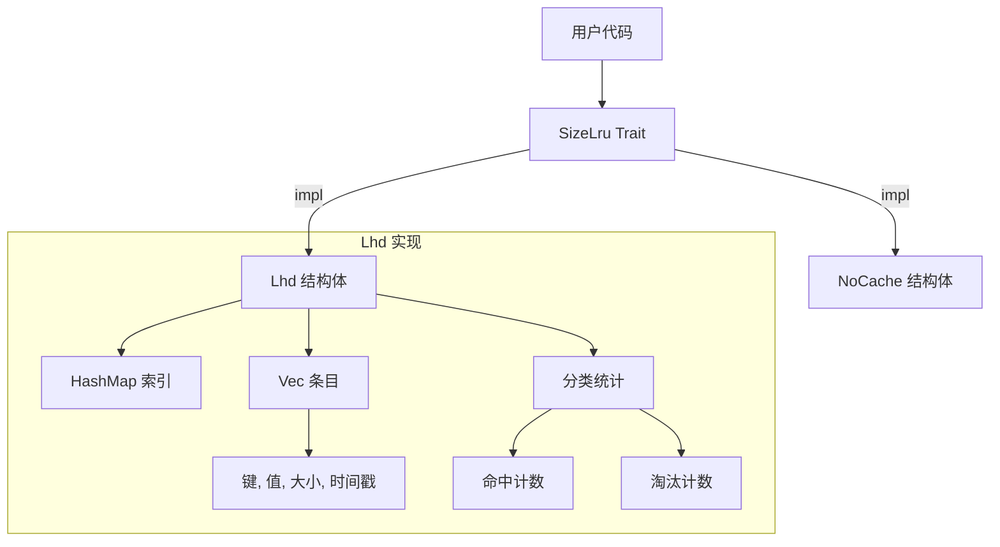
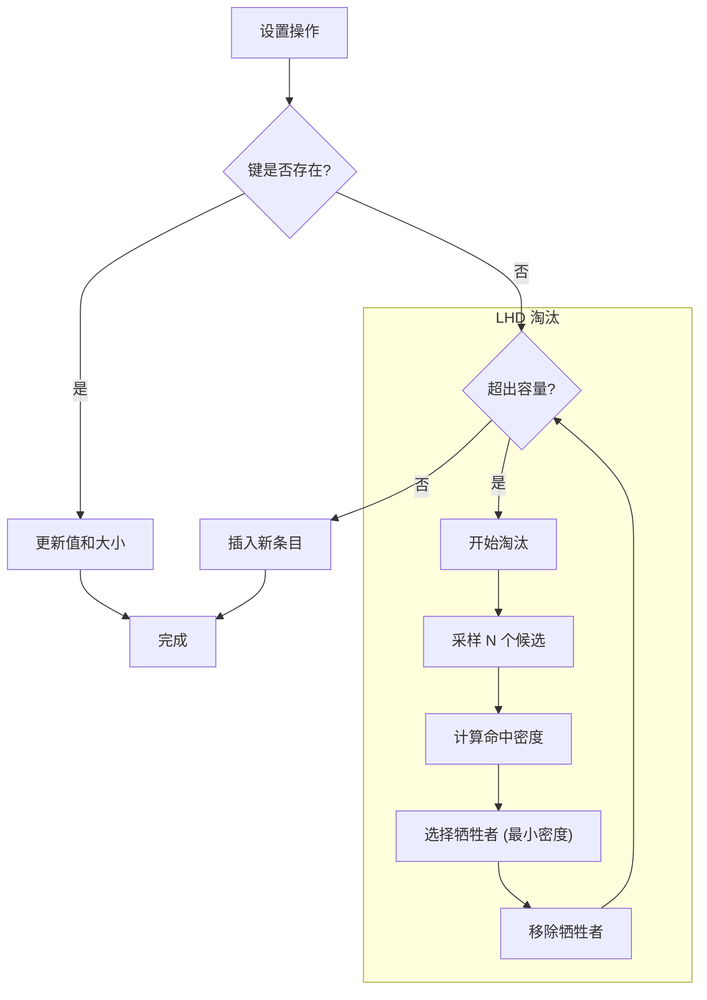
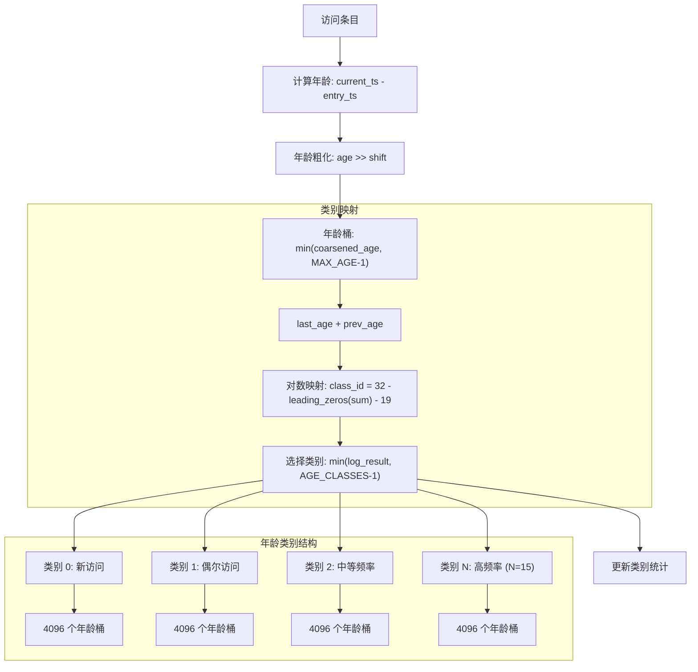
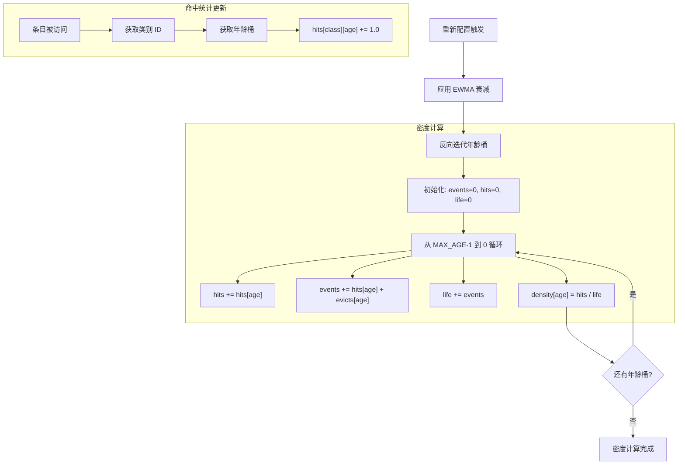
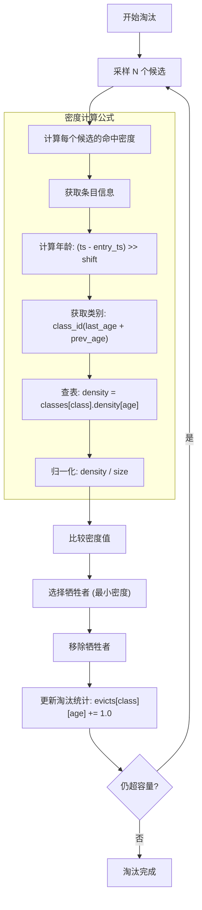

# size_lru : 智能大小感知缓存库

具备智能淘汰策略的高性能大小感知缓存库，优化内存使用。

## 目录

- [功能特性](#功能特性)
- [安装指南](#安装指南)
- [使用演示](#使用演示)
- [接口参考](#接口参考)
- [设计架构](#设计架构)
- [技术堆栈](#技术堆栈)
- [目录结构](#目录结构)
- [历史背景](#历史背景)

## 功能特性

- **大小感知**：基于对象实际大小而非数量优化存储。
- **智能淘汰**：实现 LHD (最低命中密度) 算法以最大化命中率。
- **常数复杂度**：确保获取、设置和删除操作的 O(1) 时间复杂度。
- **自适应调整**：自动调整内部参数以匹配工作负载模式。
- **零开销**：提供 `NoCache` 实现用于性能基准测试。

## 安装指南

在 `Cargo.toml` 中添加：

```toml
[dependencies]
size_lru = { version = "0.1.0", features = ["lhd"] }
```

## 使用演示

演示代码基于 `tests/main.rs`。

### 基础操作

```rust
use size_lru::Lhd;

fn main() {
  // 初始化指定容量的缓存
  let mut cache: Lhd<&str, &str> = Lhd::new(1024);

  // 设置带有明确大小的值
  cache.set("k1", "v1", 10);
  cache.set("k2", "v2", 20);

  // 获取值
  assert_eq!(cache.get(&"k1"), Some(&"v1"));

  // 检查状态
  assert_eq!(cache.len(), 2);
  assert_eq!(cache.size(), 30);

  // 删除值
  cache.rm(&"k2");
  assert_eq!(cache.get(&"k2"), None);
}
```

### 通用 Trait 用法

```rust
use size_lru::{SizeLru, Lhd};

fn cache_op<K, V>(cache: &mut impl SizeLru<K, V>, key: K, val: V, size: u32) {
  cache.set(key, val, size);
}
```

## 接口参考

### `trait SizeLru<K, V>`

缓存实现的各项核心接口。

- `fn get(&mut self, key: &K) -> Option<&V>`: 获取值引用。更新命中统计信息。
- `fn set(&mut self, key: K, val: V, size: u32)`: 插入或更新值。若超出容量将触发淘汰。
- `fn rm(&mut self, key: &K)`: 按键删除值。

### `struct Lhd<K, V>`

LHD 算法实现。

- `fn new(max: usize) -> Self`: 创建具有最大字节容量的新实例。
- `fn size(&self) -> usize`: 返回存储项目的总大小（字节）。
- `fn len(&self) -> usize`: 返回存储项目的数量。
- `fn is_empty(&self) -> bool`: 如果缓存不包含任何项目，返回真。

## 设计架构

### 架构图



### 淘汰逻辑



### 分代机制详解



### 命中率计算机制



### 密度计算与淘汰流程



## 技术堆栈

- **Rust**: 系统编程语言。
- **gxhash**: 高性能非加密哈希。
- **fastrand**: 高效伪随机数生成。

## 目录结构

```
src/
  lib.rs    # Trait 定义和模块导出
  lhd.rs    # LHD 算法实现
  no.rs     # 空操作实现
tests/
  main.rs   # 集成测试和演示
readme/
  en.md     # 英文文档
  zh.md     # 中文文档
```

## 历史背景

**LHD (最低命中密度)** 算法源自 NSDI '18 论文《LHD: Improving Cache Hit Rate by Maximizing Hit Density》。作者 (Beckmann 等人) 提议用概率框架替代复杂的启发式算法。LHD 不问“哪一项最近最少使用？”，而是问“哪一项单位空间的预期命中率最低？”。通过根据对象年龄和大小估算未来命中的概率，LHD 最大化了缓存的总命中率。本实现将这些理论成果转化为实用的 Rust 库。

### 参考文献

- **论文**: [LHD: Improving Cache Hit Rate by Maximizing Hit Density](https://www.usenix.org/conference/nsdi18/presentation/beckmann) (NSDI '18)
- **实现**: [官方模拟代码](https://github.com/beckmann/cache_replacement)
- **PDF**: [下载论文](https://www.usenix.org/system/files/conference/nsdi18/nsdi18-beckmann.pdf)