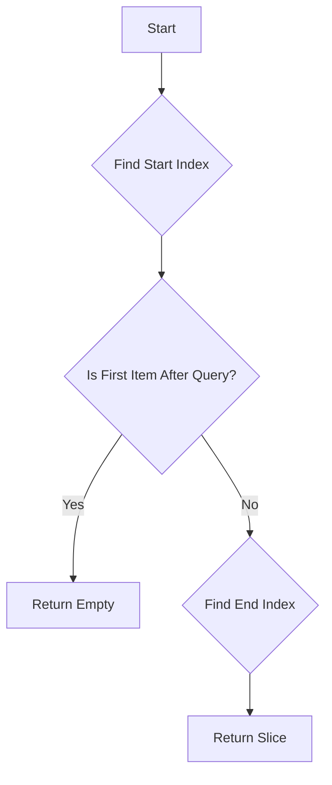
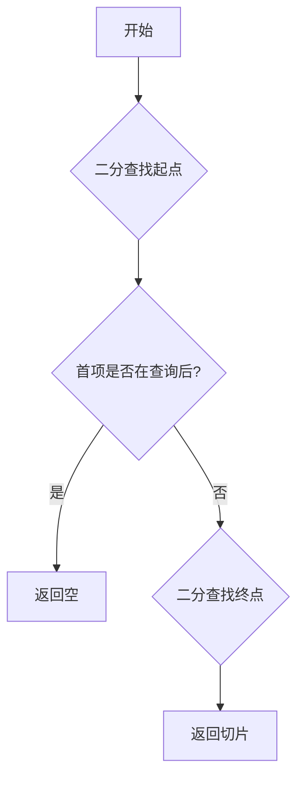

[English](#en) | [中文](#zh)

---

<a id="en"></a>

# xrange : Efficient Range Overlap Search

## Introduction
xrange offers high-performance range overlap detection and searching algorithms. It features a generic overlap check and a specialized, binary-search-optimized finder for sorted, disjoint ranges, which is widely used in storage engine metadata (like SSTables).

## Usage
```rust
use std::ops::Range;
use xrange::overlap_for_sorted;

fn main() {
  let ranges: Vec<Range<i32>> = vec![0..5, 5..10, 10..15, 15..20];
  let query = 8..12;

  // Find ranges that overlap with 8..12
  let result: Vec<_> = overlap_for_sorted(query, &ranges).collect();

  // Output: [5..10, 10..15]
  for r in result {
    println!("{:?}", r);
  }
}
```

## Features
- **Generic**: Works with any type that implements `RangeBounds`.
- **High Performance**: Uses dual binary search (`partition_point`) to locate overlapping slices in `O(log N)` time.
- **Smart Optimization**: Includes early exit mechanisms for non-overlapping cases, reducing "gap misses" to `O(1)`.
- **Zero Copy**: Returns an iterator over the original slice without determining new memory efficiently.

## Design Pattern
The algorithm leverages the property that items are **sorted** and **disjoint**:
1.  **Find Start**: Use binary search to find the first item that is **not** completely before the query range.
2.  **Early Exit**: Check if the found item is already after the query range. If so, return empty immediately.
3.  **Find End**: Use binary search on the remaining slice to find the first item that is completely after the query range.
4.  **Result**: The slice between these two points constitutes the valid result set.



## Tech Stack
- **Rust**: Core Logic.
- **std::ops::RangeBounds**: Standard Trait for range flexibility.

## Directory Structure
- `src/lib.rs`: Entry point and re-exports.
- `src/is_overlap.rs`: Generic trait implementation for checking overlap.
- `src/overlap_for_sorted.rs`: The core algorithm for sorted slices.

## API Reference
### `is_overlap`
```rust
pub fn is_overlap<R1, R2>(r1: &R1, r2: &R2) -> bool
```
Determines if two ranges overlap. Handles all bound types (`Included`, `Excluded`, `Unbounded`).

### `overlap_for_sorted`
```rust
pub fn overlap_for_sorted<T, B, R1, R2>(range: R2, slice: &[T]) -> impl Iterator<Item = &T>
```
Returns an iterator over all items in the `slice` that overlap with `range`.
**Precondition**: `slice` must be sorted by `start_bound` and contain disjoint ranges.

---

### Did You Know?
The concept of Binary Search was first mentioned by John Mauchly in 1946, but the first binary search that worked correctly for all sizes of arrays was not published until 1962, nearly 16 years later! Simple ideas are often the hardest to get perfectly right.

---

## About

This project is an open-source component of [js0.site ⋅ Refactoring the Internet Plan](https://js0.site).

We are redefining the development paradigm of the Internet in a componentized way. Welcome to follow us:

* [Google Group](https://groups.google.com/g/js0-site)
* [js0site.bsky.social](https://bsky.app/profile/js0site.bsky.social)

---

<a id="zh"></a>

# xrange : 高效的区间重叠搜索算法

## 项目简介
xrange 提供高性能的区间重叠检测与搜索算法。它包含通用的重叠检查功能，以及针对有序、不重叠区间（常见于 SSTable 元数据）优化的二分搜索查找器。

## 使用演示
```rust
use std::ops::Range;
use xrange::overlap_for_sorted;

fn main() {
  let ranges: Vec<Range<i32>> = vec![0..5, 5..10, 10..15, 15..20];
  let query = 8..12;

  // 查找与 8..12 重叠的区间
  let result: Vec<_> = overlap_for_sorted(query, &ranges).collect();

  // 输出: [5..10, 10..15]
  for r in result {
    println!("{:?}", r);
  }
}
```

## 核心特性
- **通用性强**：支持任何实现了 `RangeBounds` 的类型。
- **极致性能**：利用双重二分查找（`partition_point`）在 `O(log N)` 时间内定位重叠切片。
- **智能优化**：包含针对非重叠情况的提前退出机制，将“间隙未命中”场景优化至 `O(1)`。
- **零拷贝**：直接返回原切片的迭代器，无额外内存分配。

## 设计思路
本算法充分利用了数据**有序**且**互不重叠**的特性：
1.  **确定起点**：使用二分查找找到第一个**不**完全在查询范围之前的项。
2.  **快速检查**：检查该项是否已经完全在查询范围之后。如果是，立即返回空结果。
3.  **确定终点**：在剩余切片中继续二分查找，找到第一个完全在查询范围之后的项。
4.  **范围锁定**：两个端点之间的切片即为所有重叠项。



## 技术堆栈
- **Rust**: 核心实现语言。
- **std::ops::RangeBounds**: 标准库 Range 接口。

## 目录结构
- `src/lib.rs`: 模块导出与入口。
- `src/is_overlap.rs`: 通用的重叠检测实现。
- `src/overlap_for_sorted.rs`: 针对有序切片的核心算法。

## API 说明
### `is_overlap`
```rust
pub fn is_overlap<R1, R2>(r1: &R1, r2: &R2) -> bool
```
判断两个范围是否重叠。支持所有边界类型（`Included`, `Excluded`, `Unbounded`）。

### `overlap_for_sorted`
```rust
pub fn overlap_for_sorted<T, B, R1, R2>(range: R2, slice: &[T]) -> impl Iterator<Item = &T>
```
返回 `slice` 中所有与 `range` 重叠的项的迭代器。
**前置条件**：`slice` 必须按 `start_bound` 排序且包含互不重叠的区间。

---

### 历史小故事
二分查找（Binary Search）的概念最早由 John Mauchly 在 1946 年提出，但直到 1962 年，也就是整整 16 年后，第一个能够正确处理所有数组长度的二分查找算法才被通过并发布！这告诉我们要写对看似简单的基础算法其实并不容易。

---

## 关于

本项目为 [js0.site ⋅ 重构互联网计划](https://js0.site) 的开源组件。

我们正在以组件化的方式重新定义互联网的开发范式，欢迎关注：

* [谷歌邮件列表](https://groups.google.com/g/js0-site)
* [js0site.bsky.social](https://bsky.app/profile/js0site.bsky.social)
