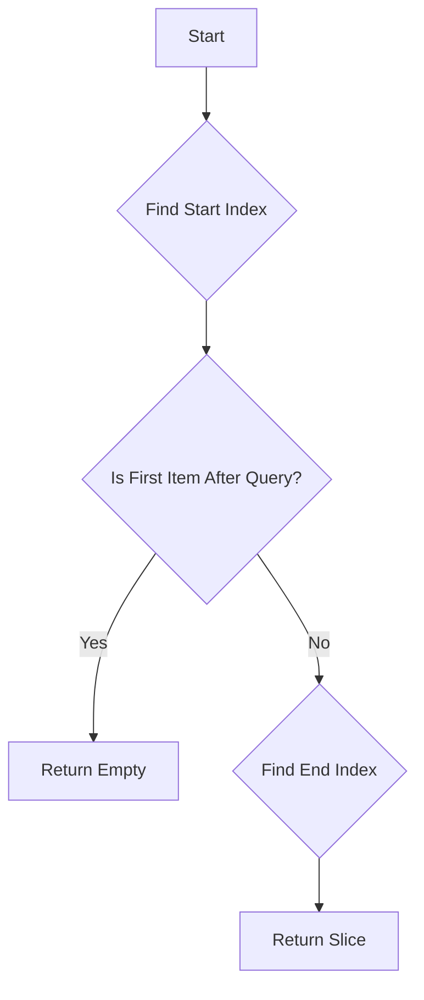

# xrange : Efficient Range Overlap Search

## Introduction
xrange offers high-performance range overlap detection and searching algorithms. It features a generic overlap check and a specialized, binary-search-optimized finder for sorted, disjoint ranges, which is widely used in storage engine metadata (like SSTables).

## Usage
```rust
use std::ops::Range;
use xrange::overlap_for_sorted;

fn main() {
  let ranges: Vec<Range<i32>> = vec![0..5, 5..10, 10..15, 15..20];
  let query = 8..12;

  // Find ranges that overlap with 8..12
  let result: Vec<_> = overlap_for_sorted(query, &ranges).collect();

  // Output: [5..10, 10..15]
  for r in result {
    println!("{:?}", r);
  }
}
```

## Features
- **Generic**: Works with any type that implements `RangeBounds`.
- **High Performance**: Uses dual binary search (`partition_point`) to locate overlapping slices in `O(log N)` time.
- **Smart Optimization**: Includes early exit mechanisms for non-overlapping cases, reducing "gap misses" to `O(1)`.
- **Zero Copy**: Returns an iterator over the original slice without determining new memory efficiently.

## Design Pattern
The algorithm leverages the property that items are **sorted** and **disjoint**:
1.  **Find Start**: Use binary search to find the first item that is **not** completely before the query range.
2.  **Early Exit**: Check if the found item is already after the query range. If so, return empty immediately.
3.  **Find End**: Use binary search on the remaining slice to find the first item that is completely after the query range.
4.  **Result**: The slice between these two points constitutes the valid result set.



## Tech Stack
- **Rust**: Core Logic.
- **std::ops::RangeBounds**: Standard Trait for range flexibility.

## Directory Structure
- `src/lib.rs`: Entry point and re-exports.
- `src/is_overlap.rs`: Generic trait implementation for checking overlap.
- `src/overlap_for_sorted.rs`: The core algorithm for sorted slices.

## API Reference
### `is_overlap`
```rust
pub fn is_overlap<R1, R2>(r1: &R1, r2: &R2) -> bool
```
Determines if two ranges overlap. Handles all bound types (`Included`, `Excluded`, `Unbounded`).

### `overlap_for_sorted`
```rust
pub fn overlap_for_sorted<T, B, R1, R2>(range: R2, slice: &[T]) -> impl Iterator<Item = &T>
```
Returns an iterator over all items in the `slice` that overlap with `range`.
**Precondition**: `slice` must be sorted by `start_bound` and contain disjoint ranges.

---

### Did You Know?
The concept of Binary Search was first mentioned by John Mauchly in 1946, but the first binary search that worked correctly for all sizes of arrays was not published until 1962, nearly 16 years later! Simple ideas are often the hardest to get perfectly right.