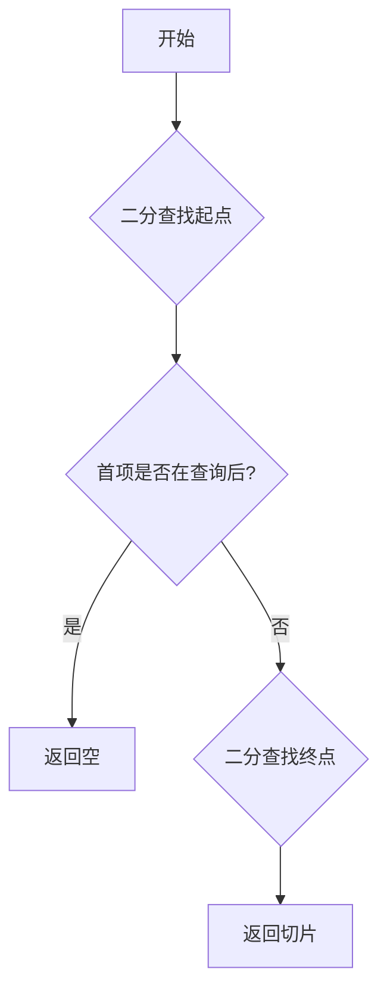

# xrange : 高效的区间重叠搜索算法

## 项目简介
xrange 提供高性能的区间重叠检测与搜索算法。它包含通用的重叠检查功能，以及针对有序、不重叠区间（常见于 SSTable 元数据）优化的二分搜索查找器。

## 使用演示
```rust
use std::ops::Range;
use xrange::overlap_for_sorted;

fn main() {
  let ranges: Vec<Range<i32>> = vec![0..5, 5..10, 10..15, 15..20];
  let query = 8..12;

  // 查找与 8..12 重叠的区间
  let result: Vec<_> = overlap_for_sorted(query, &ranges).collect();

  // 输出: [5..10, 10..15]
  for r in result {
    println!("{:?}", r);
  }
}
```

## 核心特性
- **通用性强**：支持任何实现了 `RangeBounds` 的类型。
- **极致性能**：利用双重二分查找（`partition_point`）在 `O(log N)` 时间内定位重叠切片。
- **智能优化**：包含针对非重叠情况的提前退出机制，将“间隙未命中”场景优化至 `O(1)`。
- **零拷贝**：直接返回原切片的迭代器，无额外内存分配。

## 设计思路
本算法充分利用了数据**有序**且**互不重叠**的特性：
1.  **确定起点**：使用二分查找找到第一个**不**完全在查询范围之前的项。
2.  **快速检查**：检查该项是否已经完全在查询范围之后。如果是，立即返回空结果。
3.  **确定终点**：在剩余切片中继续二分查找，找到第一个完全在查询范围之后的项。
4.  **范围锁定**：两个端点之间的切片即为所有重叠项。



## 技术堆栈
- **Rust**: 核心实现语言。
- **std::ops::RangeBounds**: 标准库 Range 接口。

## 目录结构
- `src/lib.rs`: 模块导出与入口。
- `src/is_overlap.rs`: 通用的重叠检测实现。
- `src/overlap_for_sorted.rs`: 针对有序切片的核心算法。

## API 说明
### `is_overlap`
```rust
pub fn is_overlap<R1, R2>(r1: &R1, r2: &R2) -> bool
```
判断两个范围是否重叠。支持所有边界类型（`Included`, `Excluded`, `Unbounded`）。

### `overlap_for_sorted`
```rust
pub fn overlap_for_sorted<T, B, R1, R2>(range: R2, slice: &[T]) -> impl Iterator<Item = &T>
```
返回 `slice` 中所有与 `range` 重叠的项的迭代器。
**前置条件**：`slice` 必须按 `start_bound` 排序且包含互不重叠的区间。

---

### 历史小故事
二分查找（Binary Search）的概念最早由 John Mauchly 在 1946 年提出，但直到 1962 年，也就是整整 16 年后，第一个能够正确处理所有数组长度的二分查找算法才被通过并发布！这告诉我们要写对看似简单的基础算法其实并不容易。