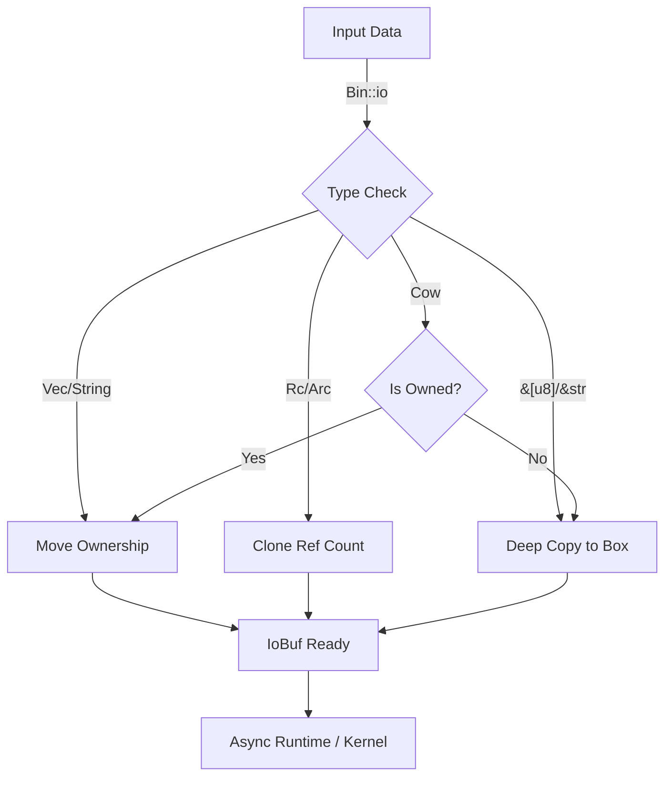

# zbin: Zero-Copy Binary Utility for Async IO

**zbin** is a lightweight compatibility layer designed for modern asynchronous I/O runtimes like `compio`. It bridges the gap between various data types (references, copy-on-write, ref-counted) and the strict ownership requirements of completion-based I/O (io_uring/IOCP).

## Table of Contents

- [Features](#features)
- [Usage](#usage)
- [Design](#design)
- [Tech Stack](#tech-stack)
- [Directory Structure](#directory-structure)
- [API Reference](#api-reference)
- [History](#history)

## Features

- **Unified Interface**: Treat `Vec<u8>`, `String`, `&[u8]`, `Bytes`, `Rc`, and `Arc` uniformly.
- **Zero-Copy Optimization**: Automatically leverages zero-copy paths for owned types (`Vec`, `String`) and reference-counted types (`Rc`, `Arc`).
- **Flexible Ownership**: Seamlessly handles ownership transfer required by `io_uring`.
- **Compio Integration**: Native support for `compio::buf::IoBuf`.

## Usage

```rust
use zbin::Bin;
use compio::io::AsyncWriteAtExt;
use compio::fs::File;

#[compio::main]
async fn main() {
    let file = File::create("/tmp/test.txt").await.unwrap();
    
    // 1. Zero-copy write (Vec moves ownership)
    let data = vec![1, 2, 3];
    file.write_all_at(data.io(), 0).await.unwrap();

    // 2. Referenced write (Automatically clones or copies)
    let static_data = b"hello";
    file.write_all_at(static_data.io(), 3).await.unwrap();
}
```

## Design

The core challenge in modern async I/O (specifically `io_uring` and IOCP) is that the kernel requires ownership of the memory buffer while the I/O operation is in flight. Standard references (`&[u8]`) cannot be safely passed to the kernel without ensuring the data remains valid indefinitely.

**zbin** solves this by defining a `Bin` trait that standardizes the conversion to an "Owned Buffer" (`IoBuf`).

### Conversion Flow



## Tech Stack

- **Rust**: Language of choice for memory safety.
- **Compio**: The target async runtime.
- **Hipstr**: Support for efficient string handling.
- **Bytes**: Optional integration with the `bytes` crate.

## Directory Structure

```text
zbin/
├── src/
│   └── lib.rs      # Core trait definition and implementations
├── tests/          # Integration tests
└── Cargo.toml      # Dependency management
```

## API Reference

### `Bin<'a>` Trait

- `as_slice(&self) -> &[u8]`: accessing data synchronously (e.g., for CRC calculation).
- `io(self) -> Self::Io`: Consumes the value and returns a type implementing `IoBuf`.

| Input Type | Conversion Strategy | Overhead |
|------------|---------------------|----------|
| `Vec<u8>` | Move | Zero |
| `String` | Move (`into_bytes`) | Zero |
| `Rc<[u8]>` | Clone Ptr | O(1) |
| `&[u8]` | Allocate `Box<[u8]>` | O(N) |

## History

In the early days of gigabit networking, a common rule of thumb was "1 Hz per bit per second" — meaning a 1 GHz CPU was needed just to saturate a 1 Gbps link, largely due to the overhead of copying data between kernel and user space. This "copy problem" plagued operating systems for decades. Initial solutions like `sendfile` helped static file serving, but general-purpose I/O remained copy-heavy. 

The introduction of `io_uring` in Linux 5.1 marked a paradigm shift, enabling true zero-copy submission queues. However, this required a new memory model where the kernel "owns" user-space buffers during execution. **zbin** was born from this necessity, creating a bridge to allow ergonomic Rust types to interact safe and efficiently with this strict ownership model.