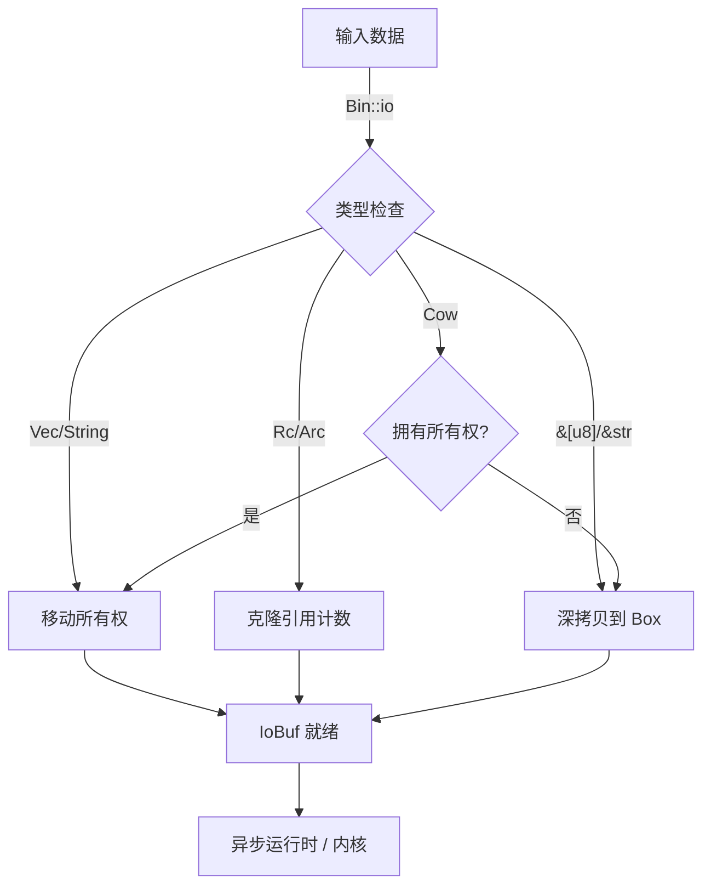

# zbin: 适用于异步 IO 的零拷贝二进制工具

**zbin** 是一个为现代异步 I/O 运行时（如 `compio`）设计的轻量级兼容层。它桥接了各种数据类型（引用、写时复制、引用计数）与基于完成的 I/O 模型（io_uring/IOCP）之间严格的所有权要求。

## 目录

- [功能特性](#功能特性)
- [使用演示](#使用演示)
- [设计思路](#设计思路)
- [技术堆栈](#技术堆栈)
- [目录结构](#目录结构)
- [API 参考](#api-参考)
- [历史轶事](#历史轶事)

## 功能特性

- **统一接口**：统一处理 `Vec<u8>`、`String`、`&[u8]`、`Bytes`、`Rc` 和 `Arc`。
- **零拷贝优化**：自动利用所有权类型（`Vec`、`String`）和引用计数类型（`Rc`、`Arc`）的零拷贝路径。
- **灵活的权属**：无缝处理 `io_uring` 所需的所有权转移。
- **Compio 集成**：原生支持 `compio::buf::IoBuf`。

## 使用演示

```rust
use zbin::Bin;
use compio::io::AsyncWriteAtExt;
use compio::fs::File;

#[compio::main]
async fn main() {
    let file = File::create("/tmp/test.txt").await.unwrap();
    
    // 1. 零拷贝写入 (Vec 所有权转移)
    let data = vec![1, 2, 3];
    file.write_all_at(data.io(), 0).await.unwrap();

    // 2. 引用写入 (自动进行 Clone 或 Copy)
    let static_data = b"hello";
    file.write_all_at(static_data.io(), 3).await.unwrap();
}
```

## 设计思路

现代异步 I/O（特别是 `io_uring` 和 IOCP）的核心挑战在于，内核要求在 I/O 操作进行期间拥有内存缓冲区的所有权。标准的引用（`&[u8]`）不能安全地传递给内核，因为无法通过编译器保证数据在异步操作完成前一直有效。

**zbin** 通过定义 `Bin` trait 解决了这个问题，标准化了向“所有权缓冲区”（`IoBuf`）的转换。

### 转换流程



## 技术堆栈

- **Rust**：内存安全的首选语言。
- **Compio**：目标异步运行时。
- **Hipstr**：支持高效的字符串处理。
- **Bytes**：可选集成 `bytes` crate。

## 目录结构

```text
zbin/
├── src/
│   └── lib.rs      # 核心 trait 定义与实现
├── tests/          # 集成测试
└── Cargo.toml      # 依赖管理
```

## API 参考

### `Bin<'a>` Trait

- `as_slice(&self) -> &[u8]`：同步访问数据（例如用于 CRC 计算）。
- `io(self) -> Self::Io`：消费值并返回实现 `IoBuf` 的类型。

| 输入类型 | 转换策略 | 开销 |
|----------|----------|------|
| `Vec<u8>` | 移动 (Move) | 零 |
| `String` | 移动 (`into_bytes`) | 零 |
| `Rc<[u8]>` | 克隆指针 | O(1) |
| `&[u8]` | 分配 `Box<[u8]>` | O(N) |

## 历史轶事

在千兆网络的早期，“1 Hz 对应 1 bit 每秒”是一个通用的经验法则——意味着仅仅是为了跑满 1 Gbps 的链路，就需要 1 GHz 的 CPU，这主要是由于数据在内核空间和用户空间之间复制的开销。这个“复制问题”困扰了操作系统几十年。最初的解决方案如 `sendfile` 帮助了静态文件服务，但通用 I/O 仍然充斥着繁重的内存复制。

Linux 5.1 中 `io_uring` 的引入标志着范式的转变，实现了真正的零拷贝提交队列。然而，这通过一个新的内存模型来实现：内核在执行期间“拥有”用户空间的缓冲区。**zbin** 正是诞生于这种需求，它建立了一座桥梁，允许符合人体工程学的 Rust 类型安全且高效地与这种严格的所有权模型进行交互。